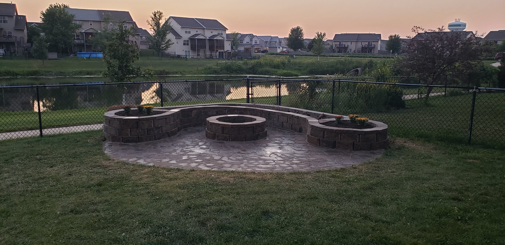
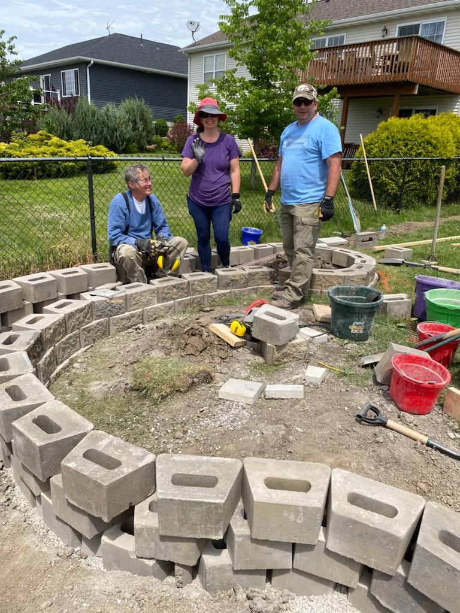
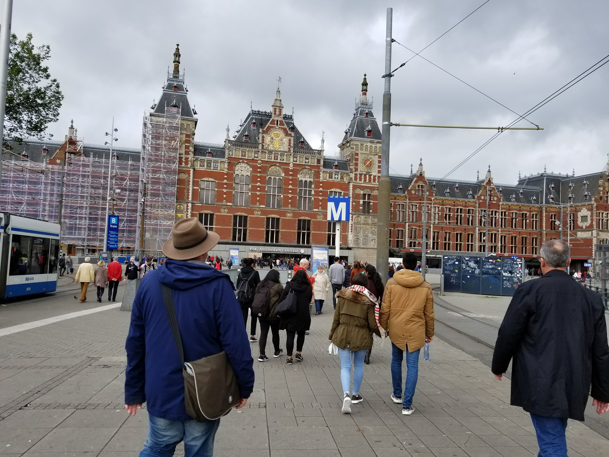
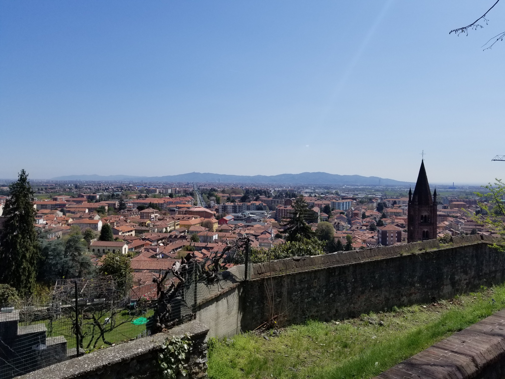
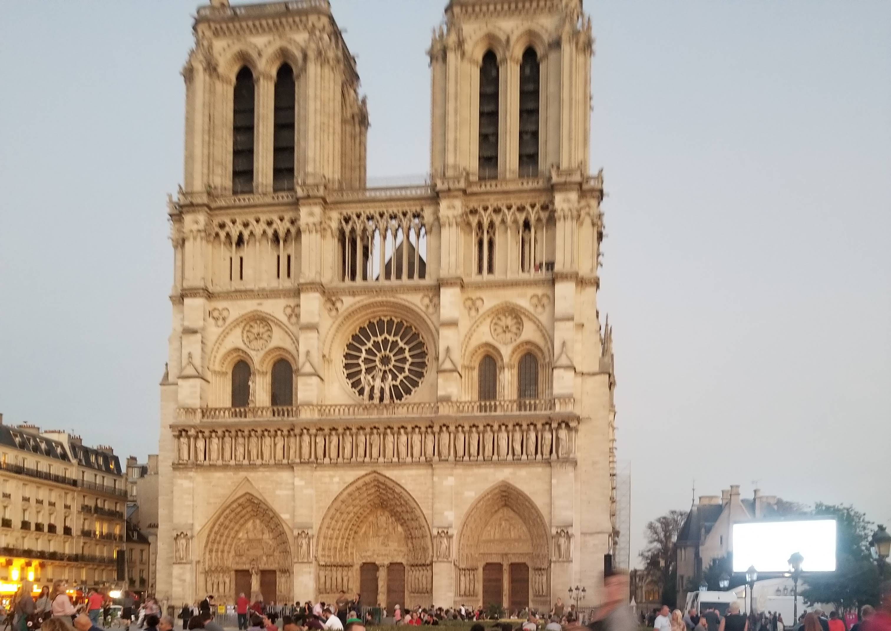
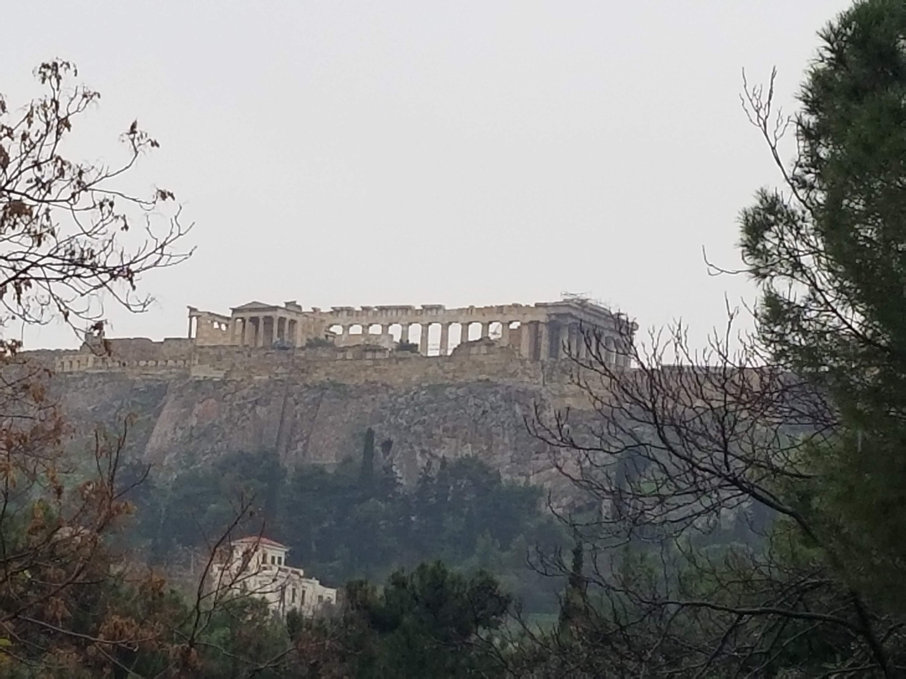
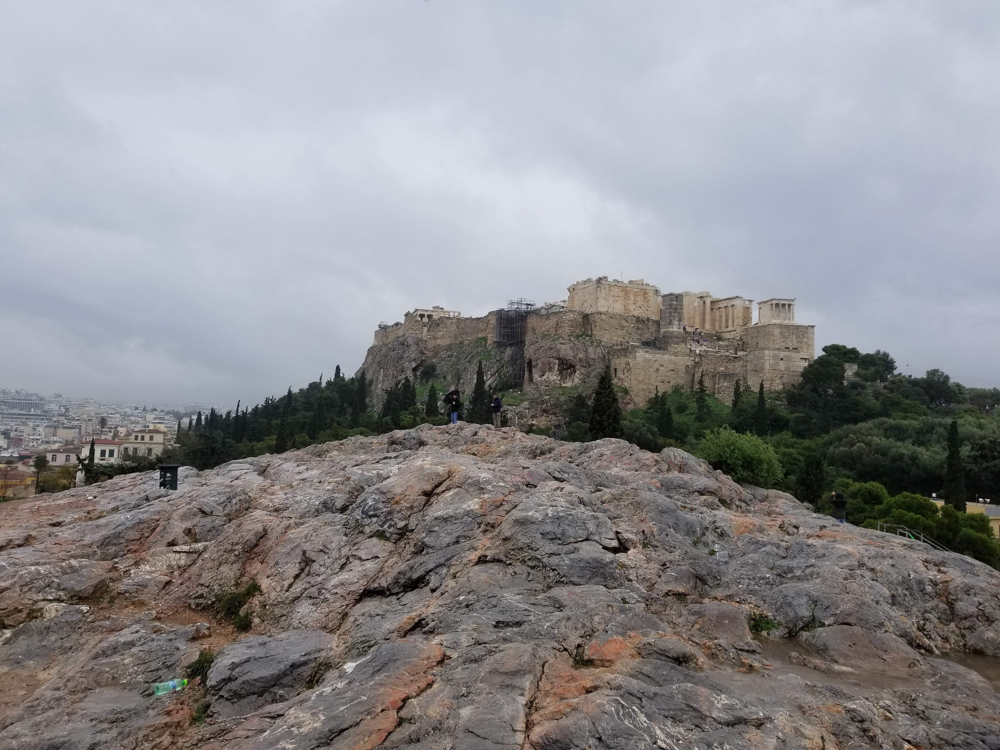
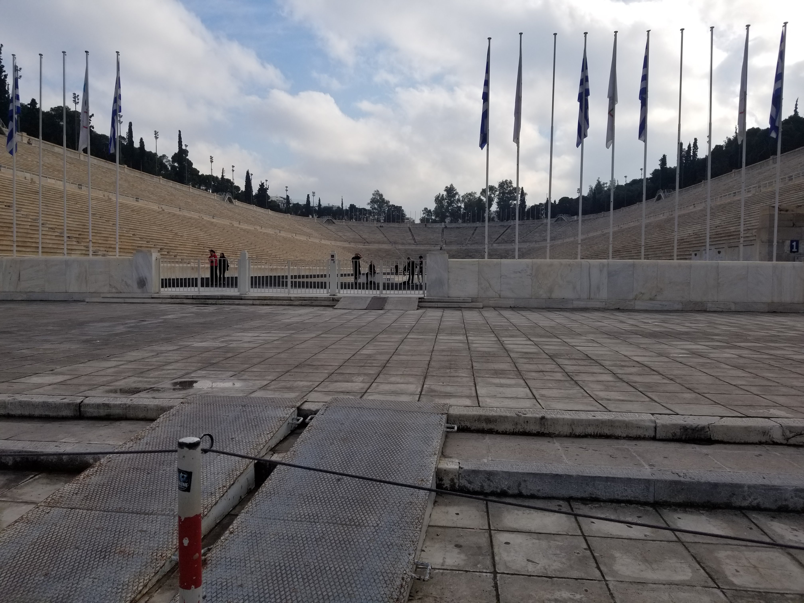
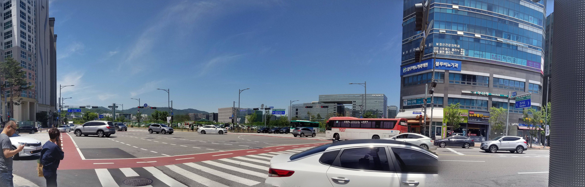

     

# About Me

This is a little about my personal interests and activities.

## Personal Research Interests
- Time series machine learning modeling.
- Random field machine learning modeling.
- Medicine &ndash; using data to advance the field of medicine.
- Weather 
	- Historical weather events & data
	- Forecasting & predictions
	- Learning about the different weather models
	- Developing my own weather models
- The Stock Market
	- Studying risk management methods.
	- Studying different trading methods of successful investors/traders.
	- Developing my own indicators to help screen for stocks.
	- Developing my own models for quantitative trading ideas.

## Personal Interests & Hobbies
- Attending my children’s activities
- Family Activities
- Hiking
- Disc Golf
- Outdoor Activities
- Gardening
- Landscaping
- Traveling [(Pictures)](#my-travel)
- DIY Projects

My wife and I do a lot of DIY projects both inside and outside the house. One big project we completed was building a patio with a fire pit and raised flower beds in our backyard, see the picture below. We left the center part of the raised bed open to use for firewood storage. We had a lot of help from our parents, children, and a couple of neighbors as well.

Expand this if you want to see some progress pictures of the project from start to finish.

<table>
	<tr>
		<td align="center">
			
			
Digging the foundation for the wall.

		</td>
		<td align="center">
			
			
Building the wall.

		</td>
		<td align="center">
			
			
Determining the patio layout.

		</td>
	</tr>
	<tr>
		<td align="center">
			
			
Determining the four different grades of the patio for proper drainage.

		</td>
		<td align="center">
			
			
Putting down the rock base for the patio.

		</td>
		<td align="center">
			
			
All whole patio blocks in place. I used a block cutter to customize the blocks to fill in the remaining spaces to complete the patio.

		</td>
	</tr>
	<tr>
		<td colspan="3" align="center">
			
		</td>
	</tr>
</table>

## My Travel
During my time at RAMDO Solutions I was fortunate to have the opportunity to travel to six different countries for business trips. I went to six different countries in about a year and a half. Not to mention all the domestic travel for work during the same time period. 

- Netherlands
- Italy
- France
- Greece
- South Korea
- Canada

The place I enjoyed visiting and seeing the most was Athens, Greece. It is a city literally built on top of ancient ruins. Below are a few pictures from some of the places I visited.

<table width="100%">
	<tr>
		<td align="center">
			
			
Netherlands

		</td>
		<td align="center">
			
			
Italy

		</td>
		<td align="center">
			
			
France

		</td>
	</tr>
	<tr>
		<td align="center">
			
			
Greece

		</td>
		<td align="center">
			
			
Greece

		</td>
		<td align="center">
			
			
Greece

		</td>
	</tr>
	<tr>
		<td colspan="3" align="center">
			
			
South Korea

		</td>
	</tr>
</table>

[Return to Top](#top)

#
     
